# SoftStore - E-commerce

SoftStore is e-commerce project build using :

- [Laravel 12.x](laravel.com). 
- [Livewire v3](livewire.laravel.com).
- [FilamentPHP v3](https://filamentphp.com).
- [Alphinejs](https://alpinejs.dev/).
- [Tailwindcss](https://tailwindcss.com).
- [Vite](https://vite.dev).
- [Preline UI](https://preline.co).
- Livewire Alert
- Sqlite.


# Features :

⚡ Powerful & modren admin panle that build with [FilamentPHP](https://filamentphp.com).

⚡ Markdown Editor in create products page

⚡ Dark & Light mode

⚡ Fast navigating using `wire:navigate` to faster page loading

⚡ Filters & realtime search in datatables

⚡ Real-time & interactive UI using [Livewire v3](livewire.laravel.com)


## Admin Panel 💻👏🏼

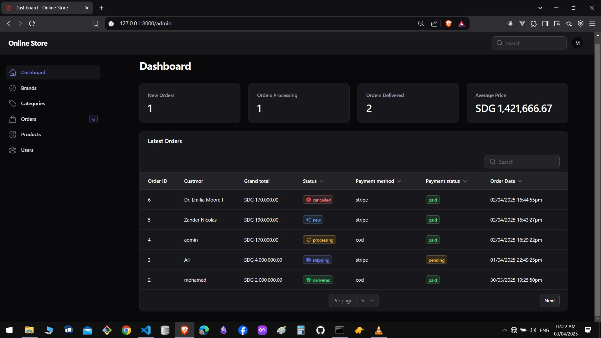
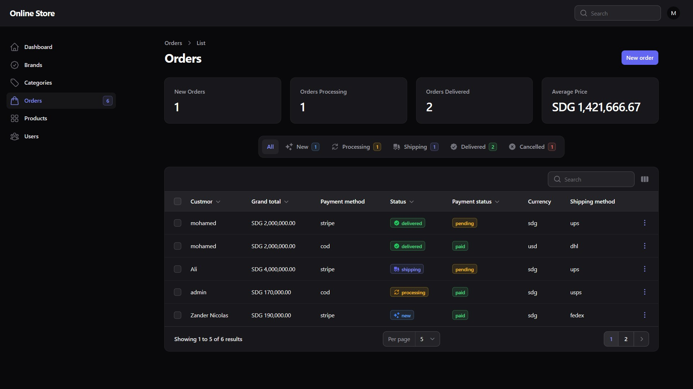
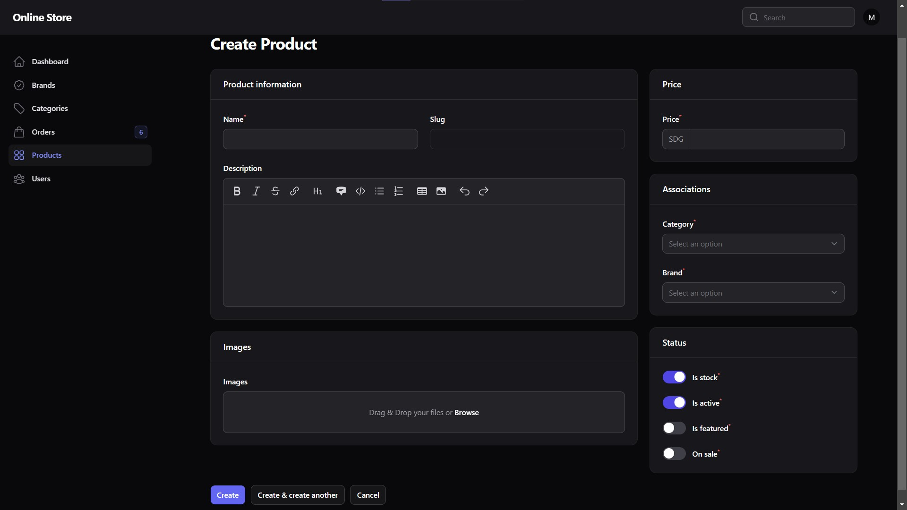

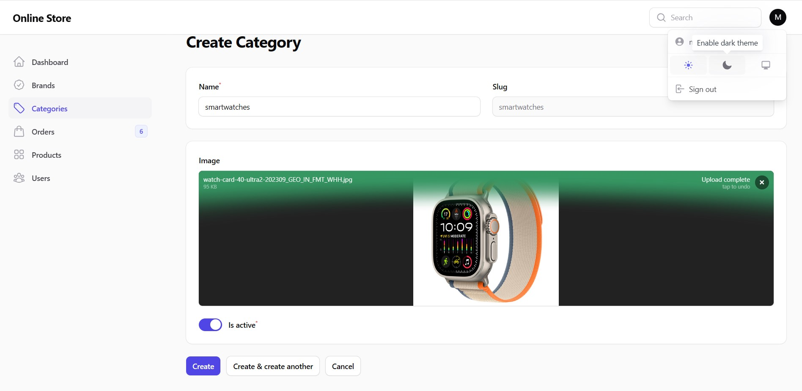
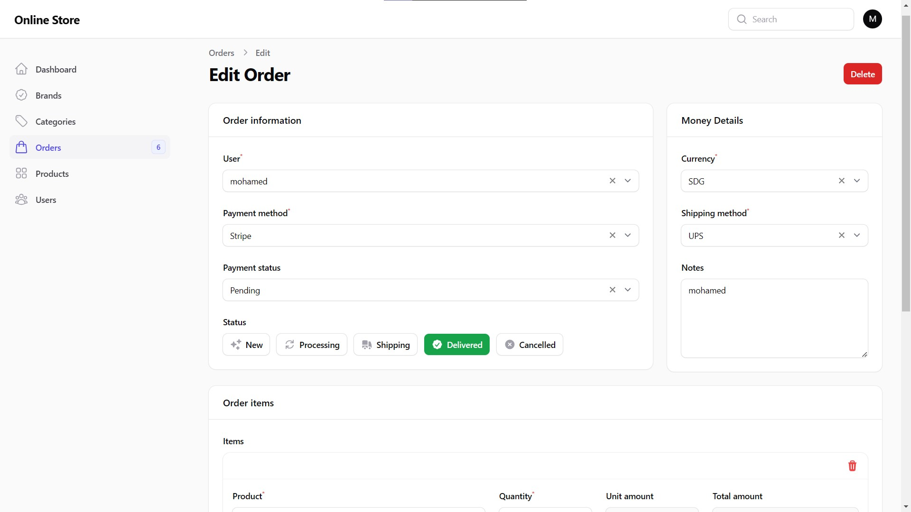
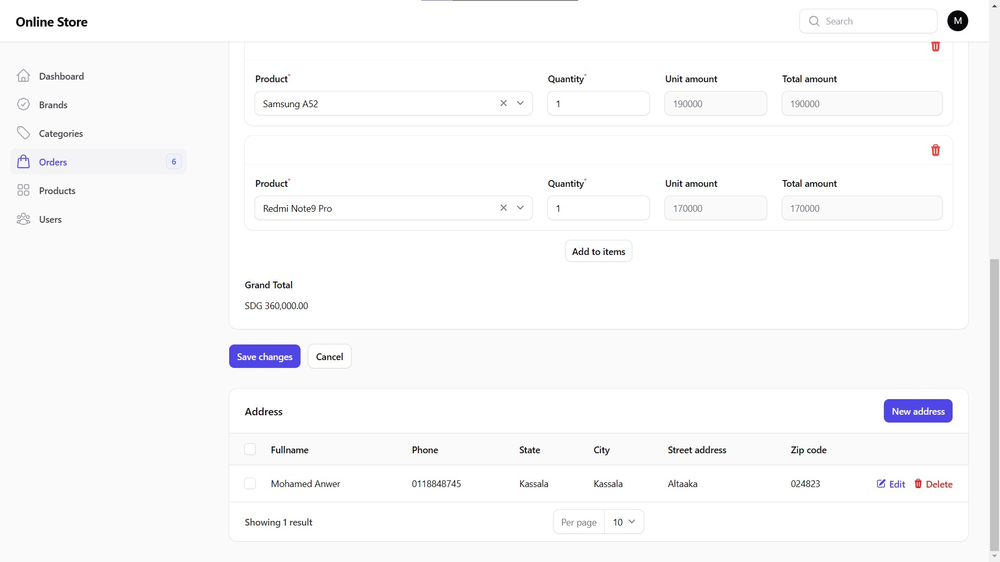

---

## Store & User panel

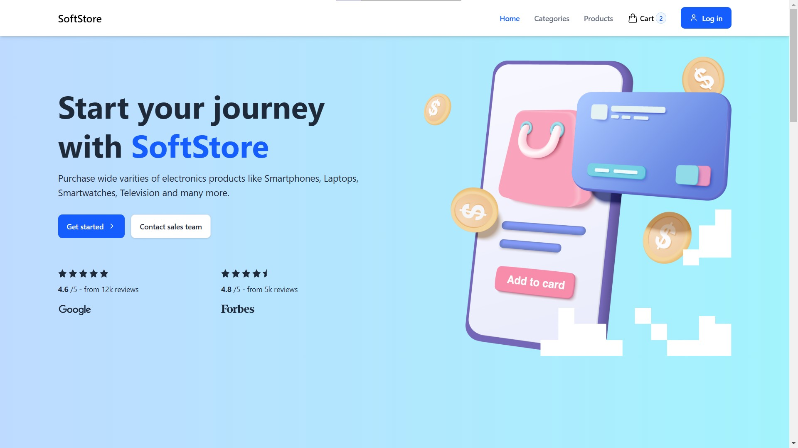
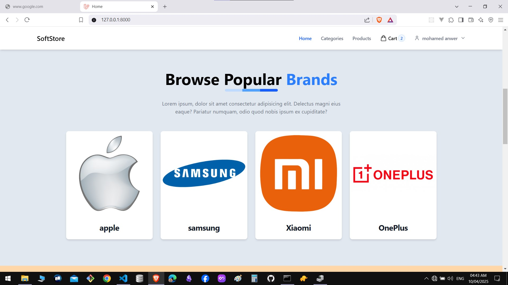
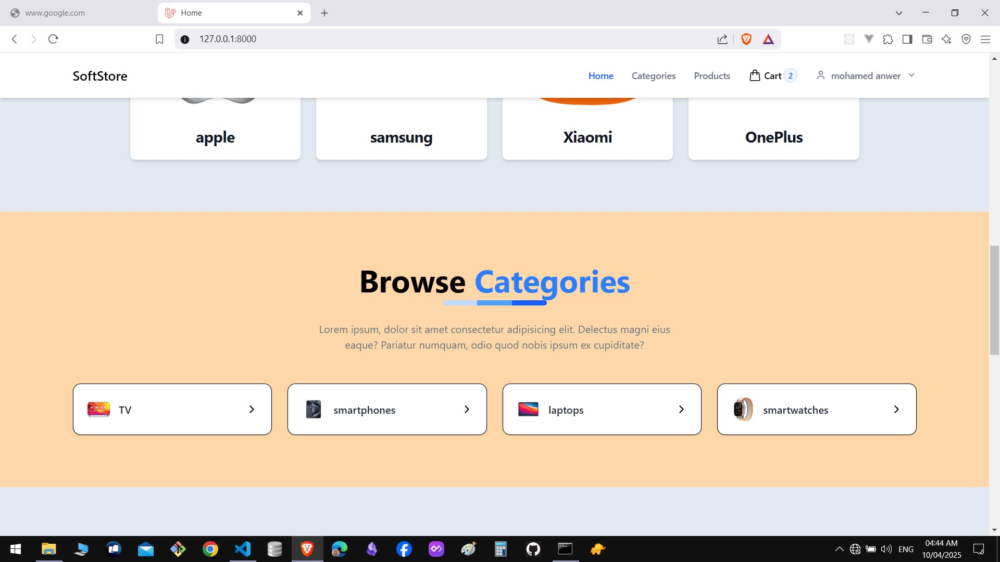
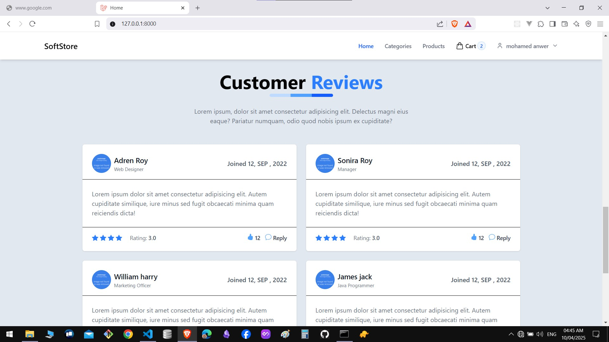
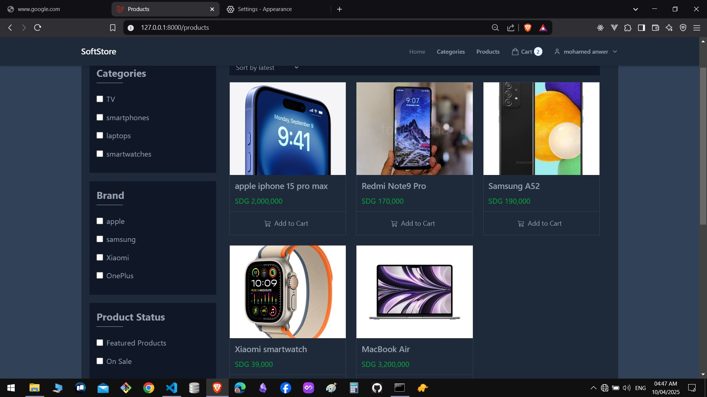
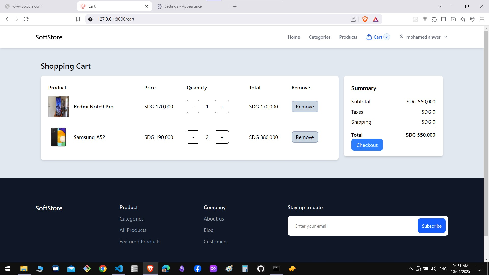

### Auth Pages
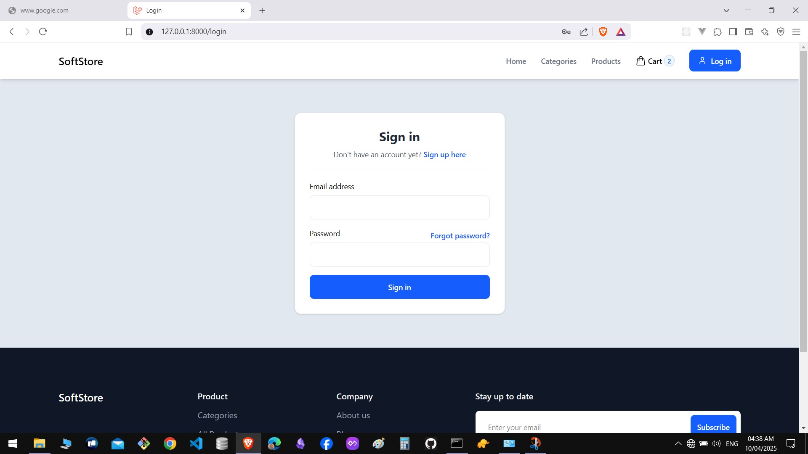
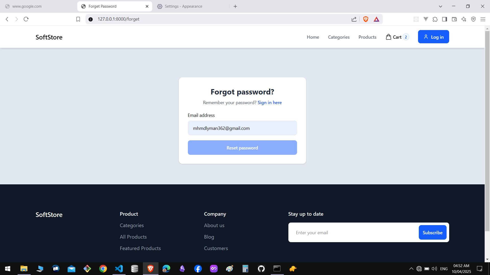
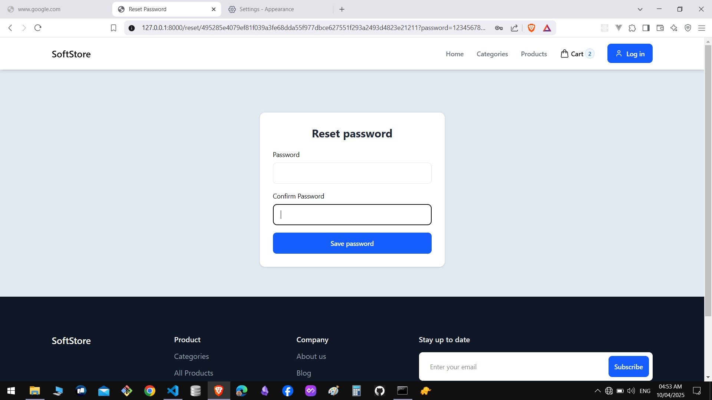


---

## install & run ⚡

1- install laravel farmework dependencies
```
composer install
```

2- install `laravel-vite-plugin`

```
npm install
```
3- install `tailwindcss`
```
npm install tailwindcss -D autoprefixer
&&
npx tailwind init
```

4- install `preline ui` 

```
npm i preline
```

5- run database migrations

```
php artisan migrate
```

6- run application
```
php artisan serve
```
